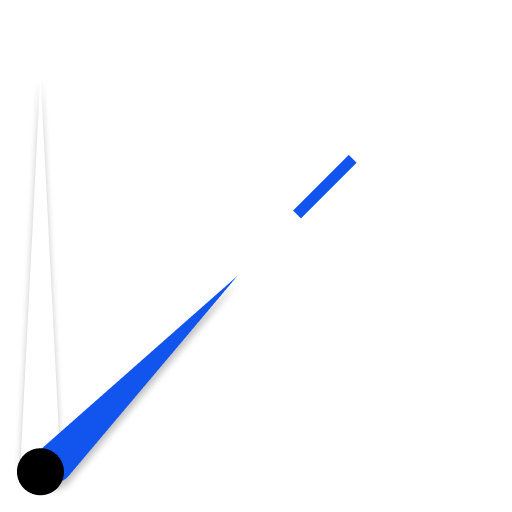

  

<h1 align="center">HRLY</h1>

HRLY (Hourly) is a minimalist hourly chime app designed to help you keep track of time without constantly checking your phone. It uses a simple system of long and short tones to signify the hour, running quietly in the background.

  

## How It Works

The app uses a combination of two sounds to represent the time:
*   **1 short tone** = 1 hour
*   **1 long tone** = 5 hours

These tones compound to announce the current hour. For example, 7:00 will be announced with one long tone and two short tones.

## Features

*   **Simple Time System:** Easily learn the time-telling system.
*   **Background Service:** Runs efficiently in the background to chime on the hour.
*   **Optional Visual Pulse:** For devices that support it, an optional visual pulse can accompany the chime on the lock screen.
*   **User Control:** Easily enable or disable the chime service and visual pulse from the main screen.
*   **Minimalist Design:** A clean, no-frills interface.